# Uddokta — Document 3: App Flow

**Document type:** App Flow  
**Product:** Uddokta  
**Positioning:** Mobile-first sales, order, follow-up, and trust-control system for Bangladeshi F-commerce and WhatsApp-heavy SME sellers  
**Primary user:** Non-technical Bangladeshi business owner operating mostly from a mobile phone  
**Document status:** Build-ready working specification  

---

## 0. Source Discipline

This app flow is derived from the Uddokta Business Blueprint and the Bangladesh SME SaaS Feasibility Study uploaded by the founder. It is also aligned with current public market/platform evidence:

- DataReportal reports Bangladesh had 186 million cellular mobile connections, 82.8 million internet users, and 64 million social media user identities in late 2025. Facebook ad reach was 64 million users, equivalent to 77.3% of the local internet user base. This supports a mobile-first, Facebook/WhatsApp-led product flow rather than a desktop-first SaaS flow.  
  Source: https://datareportal.com/reports/digital-2026-bangladesh
- WhatsApp Business Platform is used for business messaging, support, customer engagement, and conversational commerce; official production messaging should therefore use the WhatsApp Cloud API rather than unofficial QR tools.  
  Source: https://www.whatsappbusiness.com/products/business-platform/
- bKash Personal Retail Account is designed for micro and small businesses, including retail and F-commerce sellers, which supports payment-proof and manual verification flows for early Uddokta versions.  
  Source: https://www.bkash.com/en/page/personal-retail-account
- Pathao Courier publicly positions itself around courier delivery, merchant onboarding, live parcel tracking, cash-on-delivery, parcel return, and nationwide delivery.  
  Source: https://pathao.com/courier/
- Steadfast Courier publicly positions itself around e-commerce delivery, cash-on-delivery collection, online management, real-time tracking, and merchant dashboards.  
  Source: https://steadfast.com.bd/

**Rule:** Do not design Uddokta as a generic CRM, chatbot, or marketing automation tool. Every flow must help the seller move from messy chat to structured order, trust proof, follow-up, and report.

---

# 1. App Flow Objective

The Uddokta app flow must create one immediate feeling for the seller:

> “I can control my Facebook/WhatsApp business from my phone.”

The core flow must be:

```text
Customer message
→ seller sees it in Uddokta inbox
→ seller replies or uses quick reply
→ seller creates order from the conversation
→ Uddokta generates order card
→ Uddokta sends receipt/trust link
→ seller updates order status
→ follow-up/reminder happens
→ report shows business activity
```

The app should not ask the customer to understand software. The customer should continue using WhatsApp, Messenger, Instagram, or public receipt links. The seller sees the control layer.

---

# 2. User Roles

## 2.1 Customer / Buyer

The buyer interacts through:

- Facebook comment
- Messenger DM
- WhatsApp message
- Instagram DM or comment later
- Public receipt link
- Public trust profile page
- Review form link

The buyer should not need to install anything.

## 2.2 Seller Owner

The owner operates from mobile and needs:

- Today’s order control
- Staff visibility
- Payment/courier status
- Follow-up status
- Report summary
- Customer history
- Bot pause/manual takeover

## 2.3 Seller Staff

Staff needs:

- Assigned chats
- Product quick replies
- Create order button
- Follow-up due list
- Customer notes
- Permission-limited access

Staff should not see billing, platform settings, workspace settings, or other sensitive admin controls unless allowed.

## 2.4 Uddokta Admin / Internal Operator

Internal admin needs:

- Create workspace
- Set up client profile
- Configure products/FAQ
- Connect channels
- Monitor message failures
- Pause automation
- Generate reports
- Handle payment status
- Fix onboarding issues

---

# 3. Global Navigation Model

Uddokta must be a **mobile-first PWA**. The navigation should use bottom tabs because most users will operate from low/mid-range Android phones and are familiar with mobile app navigation patterns.

## 3.1 Primary Seller Bottom Tabs

```text
Home | Inbox | Orders | Customers | Reports
```

## 3.2 Secondary Screens

Accessible from primary screens:

```text
Products
Auto Replies
Follow-ups
Settings
Trust Profile
Staff
Support
```

## 3.3 Floating Action Button

The floating action button should appear on Home, Inbox, Orders, and Customers.

Primary actions:

```text
+ New Order
+ New Customer
+ Add Product
+ Send Follow-up
+ Create Receipt
```

Do not show all actions at once. Show contextual actions based on the screen.

---

# 4. High-Level Product Flow

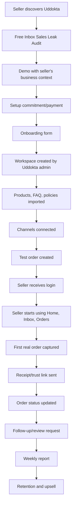

---

# 5. Public Marketing-to-Onboarding Flow

## 5.1 Entry Points

A seller may enter Uddokta through:

- Facebook page post
- Founder profile post
- Facebook group value post
- TikTok/Reels demo
- Instagram Reel
- Referral
- Direct WhatsApp conversation
- Free tool such as Sales Leak Calculator
- Landing page CTA

Primary CTA:

```text
Get Free Inbox Sales Leak Audit
```

Secondary CTAs:

```text
See Mobile Demo
Talk on WhatsApp
View Sample Dashboard
```

## 5.2 Free Audit Flow

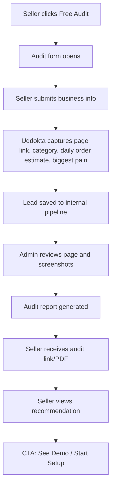

## 5.3 Audit Form Fields

Minimum fields:

| Field | Required | Reason |
|---|---:|---|
| Business name | Yes | Personalize audit and demo |
| Owner name | Yes | Communication |
| Phone/WhatsApp | Yes | Follow-up |
| Facebook page link | Yes | Inspect public selling flow |
| Business category | Yes | Apply segment-specific scoring |
| Average daily messages | Optional | Estimate operational load |
| Average daily orders | Optional | Estimate operational maturity |
| Biggest problem | Yes | Position solution correctly |
| Courier used | Optional | Prepare delivery flow |
| Payment method | Optional | bKash/Nagad/COD flow |
| Screenshots | Optional | Better audit evidence |

## 5.4 Audit Output Flow

Audit report sections:

```text
Sales Leak Score
Trust Proof Score
Order Control Score
Staff Control Risk
Delivery/COD Risk
Recommended Uddokta Setup
```

The audit must not fabricate exact losses. It should use language like:

```text
Based on your current manual process, missed replies and untracked follow-ups may be causing order leakage. We recommend converting every interested chat into a trackable order card.
```

---

# 6. Seller Onboarding Flow

## 6.1 Onboarding Principle

The seller should experience onboarding as guided service, not software setup.

```text
Submit info
→ approve scripts
→ receive login
→ see test order
→ use dashboard
```

## 6.2 Onboarding Flow Diagram

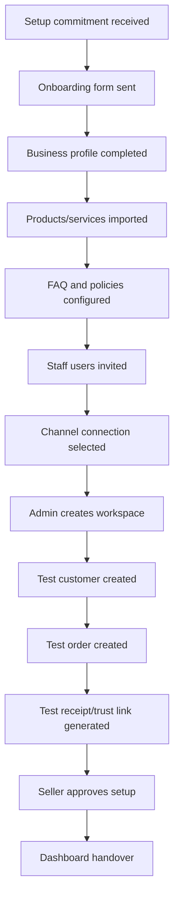

## 6.3 Onboarding Steps in App

### Step 1: Welcome

Screen copy:

```text
Welcome to Uddokta.
We will help you organize your inbox, orders, customers, and follow-ups from one mobile dashboard.
```

Actions:

```text
Start Setup
Talk to Support
```

### Step 2: Business Details

Fields:

- Business name
- Logo
- Business category
- Owner name
- Owner phone
- Business address
- Preferred language: Bangla / English / Bangla + English / Banglish

### Step 3: Social Channels

Fields:

- Facebook page URL
- WhatsApp number
- Instagram URL
- Messenger usage: Yes/No
- Current staff handling inbox

### Step 4: Products / Services

Input options:

- Add manually
- Upload sheet
- Send product screenshots to Uddokta admin
- Import later

Fields:

- Product name
- Price
- Stock status
- Variants
- Delivery charge rules
- Product FAQ

### Step 5: Policies

Fields:

- Delivery policy
- Return/refund policy
- Payment method
- Warranty/authenticity note
- Support hours

### Step 6: Staff

Fields:

- Staff name
- Phone/email
- Role: Owner / Manager / Staff / Viewer
- Assigned channel/product category

### Step 7: Setup Review

Show checklist:

```text
✓ Business profile
✓ Products
✓ FAQ
✓ Return policy
✓ Delivery policy
✓ Staff
✓ Test order
✓ Receipt link
```

Action:

```text
Approve Setup
Request Changes
```

---

# 7. Login and Workspace Flow

## 7.1 First Login

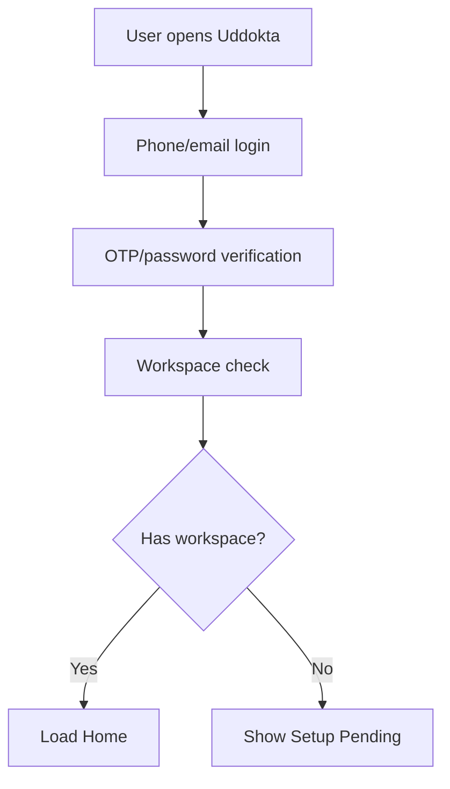

## 7.2 Workspace Selection

Most sellers will have one workspace. Do not show workspace switcher unless the user has multiple businesses.

If multiple workspaces:

```text
Choose Business
- Beauty Glow BD
- Gadget Hub BD
```

## 7.3 Setup Pending State

Screen copy:

```text
Your setup is being prepared.
We are adding your products, replies, and test order. You will receive a message when your dashboard is ready.
```

Actions:

```text
Send Missing Info
Contact Support
```

---

# 8. Home Dashboard Flow

## 8.1 Home Purpose

The Home screen is the seller’s daily command center. It must answer:

- What needs attention now?
- How many orders are pending?
- Which follow-ups are due?
- Are messages being missed?
- Is the business running properly?

## 8.2 Home Flow

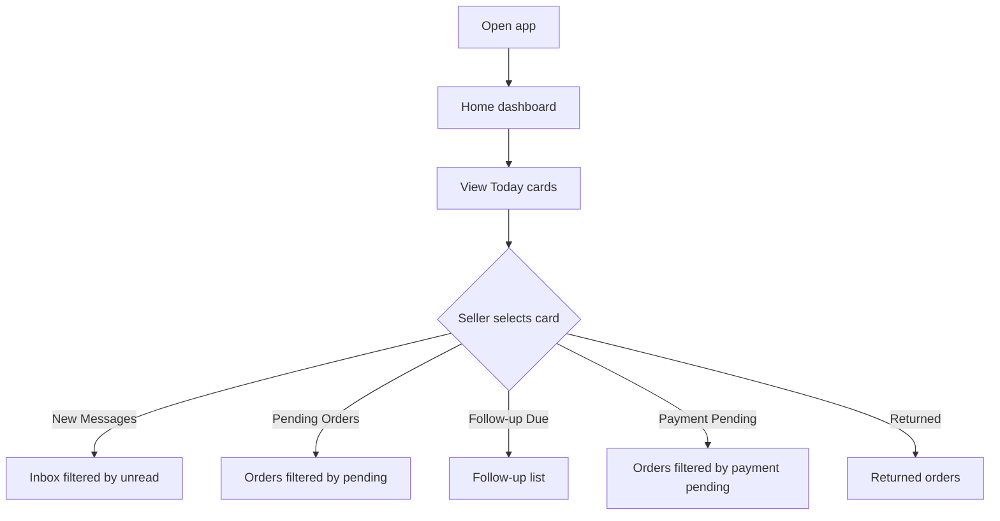

## 8.3 Home Cards

| Card | Tap Destination | Meaning |
|---|---|---|
| New Messages | Inbox/unread | Conversations needing response |
| Pending Orders | Orders/new | Orders not confirmed yet |
| Payment Pending | Orders/payment-pending | Customer has not paid or proof not verified |
| Ready to Ship | Orders/ready-to-ship | Courier action required |
| Follow-up Due | Follow-ups | Interested customers waiting |
| Missed Messages | Inbox/missed | Messages outside response rule |
| Estimated Sales | Reports | Sales estimate based on confirmed orders |
| Issues | Customer issues | Refund/return/complaint items |

## 8.4 Home Empty State

If no data:

```text
Your dashboard is ready.
Create your first order or connect an inbox to start tracking sales.
```

Actions:

```text
Create Test Order
Add Product
Connect Inbox
```

---

# 9. Inbox Flow

## 9.1 Inbox Purpose

The inbox is not just chat. It is the starting point for order creation.

## 9.2 Inbox List Flow

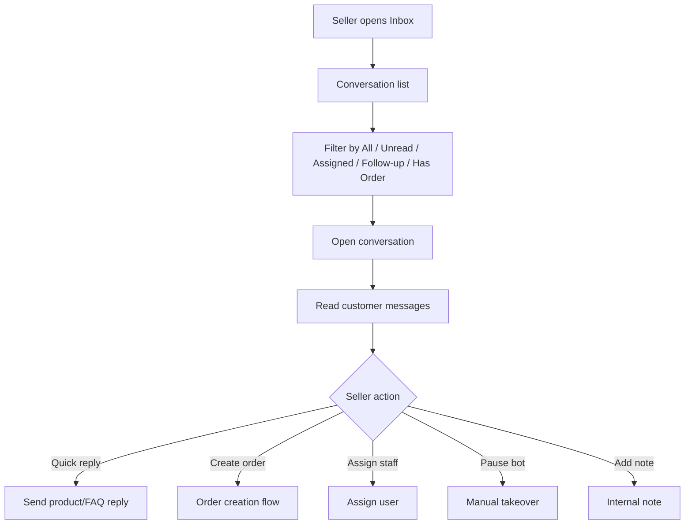

## 9.3 Conversation List Item

Each conversation card shows:

```text
Customer name / phone
Channel icon
Last message preview
Time
Assigned staff
Unread badge
Order badge
Follow-up due badge
Priority badge
```

## 9.4 Conversation Detail Flow

Inside conversation:

1. Seller sees chat bubbles.
2. Seller sees customer profile drawer.
3. Seller taps quick reply or product.
4. Seller can create order.
5. Seller can add note.
6. Seller can assign staff.
7. Seller can pause/resume auto-reply.

## 9.5 Quick Reply Flow

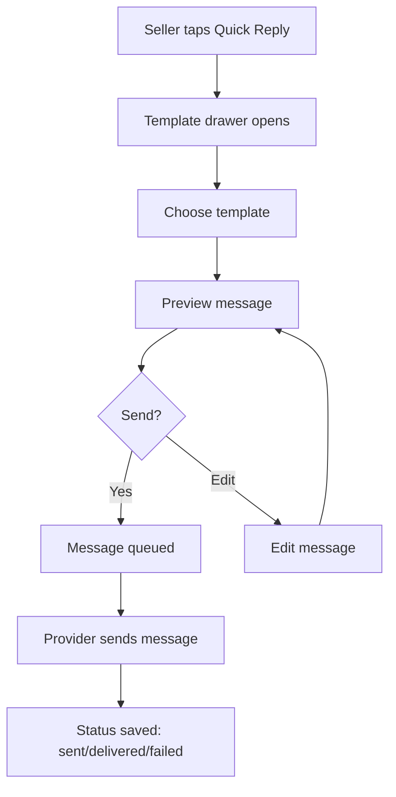

Quick reply categories:

- Price
- Available
- Delivery charge
- Return policy
- Authenticity/warranty
- Ask address
- Ask payment
- Confirm order
- Send receipt
- Human handoff

## 9.6 Bot Pause / Manual Takeover Flow

```text
Conversation → Pause Auto Reply → Choose duration → Confirm
```

Options:

- Pause for this conversation
- Pause for this customer
- Pause all bot replies temporarily

Required warning:

```text
Auto-replies will stop for this conversation. Staff must reply manually.
```

---

# 10. Message-to-Order Flow

## 10.1 Core Flow

This is the most important Uddokta flow.

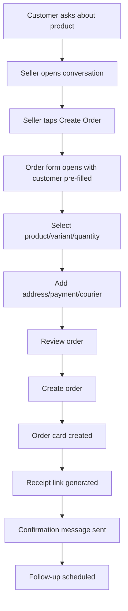

## 10.2 Create Order Form Sections

### Customer

- Name
- Phone
- Address
- Area
- City
- Notes

Auto-fill from customer profile if available.

### Product

- Product
- Variant
- Quantity
- Price
- Delivery charge
- Discount

### Payment

- COD
- bKash
- Nagad
- Bank
- Paid / Unpaid / Needs verification

### Delivery

- Courier
- Delivery area
- Delivery note
- Tracking later

### Review

Show final summary:

```text
Customer: Nusrat Jahan
Product: Skincare Set x1
Total: ৳1,850
Payment: COD
Delivery: Mirpur, Dhaka
```

Actions:

```text
Create Order
Create + Send Receipt
Save Draft
```

## 10.3 Order Created Success State

```text
Order created successfully.
Order #UDD-1048 is now in Pending status.
```

Actions:

```text
Send Receipt
Open Order
Back to Inbox
```

---

# 11. Orders Flow

## 11.1 Order Board Purpose

The order board replaces screenshots, notebooks, and scattered sheets.

## 11.2 Order Statuses

Required statuses:

```text
New
Confirmed
Payment Pending
Ready to Ship
Shipped
Delivered
Returned
Cancelled
```

## 11.3 Order Board Flow

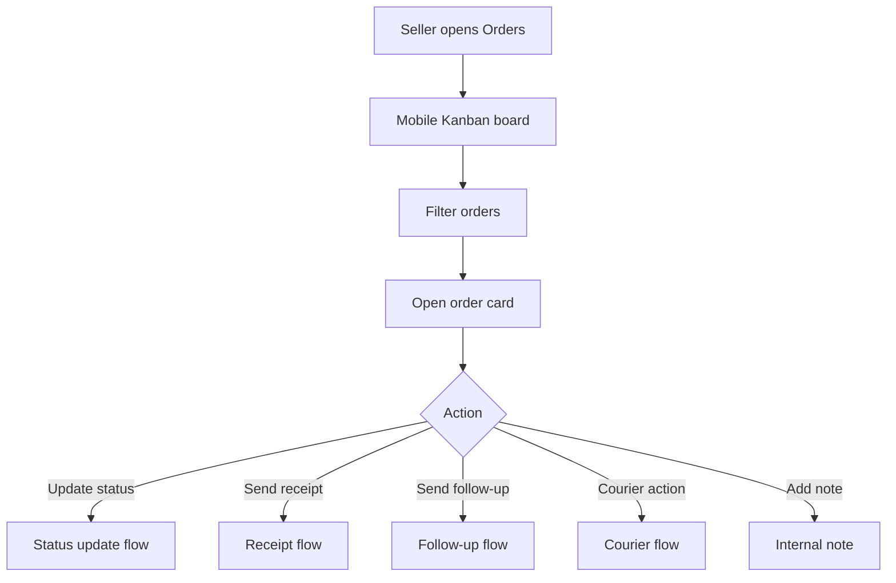

## 11.4 Status Update Flow

```text
Open order → Tap status → Choose new status → Confirm → Optional message to customer → Save audit event
```

Status movement rules:

| From | Allowed Next |
|---|---|
| New | Confirmed, Cancelled |
| Confirmed | Payment Pending, Ready to Ship, Cancelled |
| Payment Pending | Ready to Ship, Cancelled |
| Ready to Ship | Shipped, Cancelled |
| Shipped | Delivered, Returned |
| Delivered | Review Requested, Issue Created |
| Returned | Closed, Issue Created |
| Cancelled | Closed |

## 11.5 Order Detail Screen

Sections:

- Order number
- Customer summary
- Items
- Payment status
- Delivery status
- Courier/tracking
- Timeline
- Messages
- Notes
- Attachments/payment proof
- Follow-ups
- Receipt link

Primary actions:

```text
Call Customer
WhatsApp
Send Receipt
Move Status
Add Note
Create Issue
```

---

# 12. Customer Flow

## 12.1 Customer List Flow

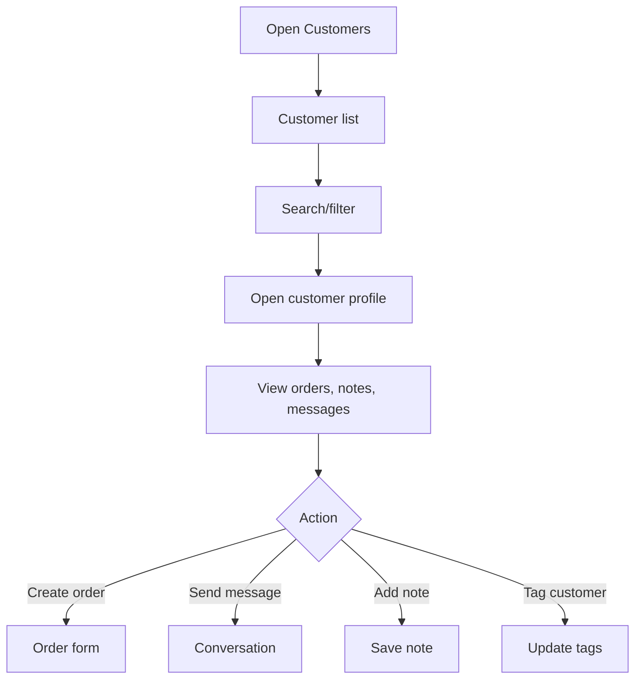

## 12.2 Customer Profile Sections

- Name
- Phone
- Address
- Tags
- Total orders
- Total spent
- Last order
- Return/cancel history
- Product preferences
- Conversation history
- Notes
- Review history
- Risk notes

## 12.3 Customer Risk Note Flow

Do not label customers as “fake” without evidence. Use neutral labels:

```text
Delivery issue
Address incomplete
Payment proof pending
Returned before
Needs advance confirmation
```

This avoids reputational and legal risk.

---

# 13. Product and FAQ Flow

## 13.1 Product List Flow

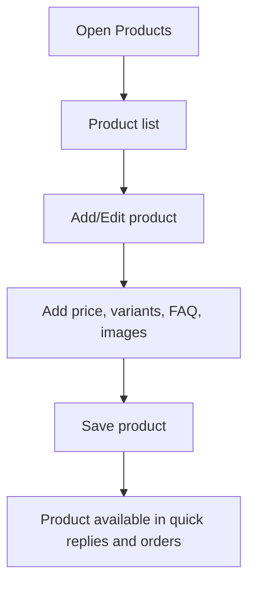

## 13.2 Product Fields

- Name
- Image
- Price
- Sale price
- Variants
- Stock status
- Delivery charge note
- FAQ
- Quick reply template
- Authenticity/warranty note

## 13.3 Product Quick Reply Flow

```text
Conversation → Product drawer → Choose product → Choose template → Preview → Send
```

Templates:

- Product price
- Size/color options
- Stock available
- Delivery charge
- Authenticity/warranty
- Order confirmation

---

# 14. Auto-Reply Flow

## 14.1 Auto-Reply Philosophy

Uddokta should not expose a complex automation builder in the MVP. Show simple business rules.

## 14.2 Auto-Reply Settings Flow

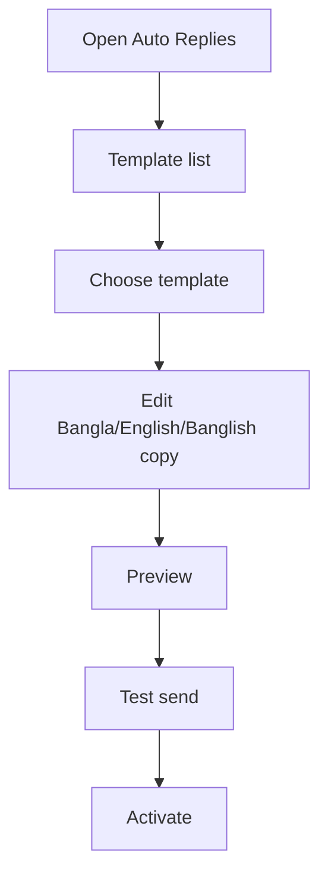

## 14.3 Auto-Reply Types

- Business hours reply
- Price question reply
- Delivery charge reply
- Return policy reply
- Payment instruction reply
- Order intake reply
- Human handoff reply
- Out-of-stock reply

## 14.4 Safety Rules

- Every auto-reply must be previewable.
- Owner can pause bot.
- Campaign or promotional outbound messages require explicit approval.
- Payment confirmation must not be automated unless verified by official payment integration.

---

# 15. Follow-Up Flow

## 15.1 Follow-Up Purpose

Follow-up reduces lead leakage. It should not become spam.

## 15.2 Follow-Up Types

```text
Interested but not ordered
Address missing
Payment proof pending
Pre-shipping confirmation
Delivery status check
Delivered review request
Repeat purchase reminder
```

## 15.3 Follow-Up Flow

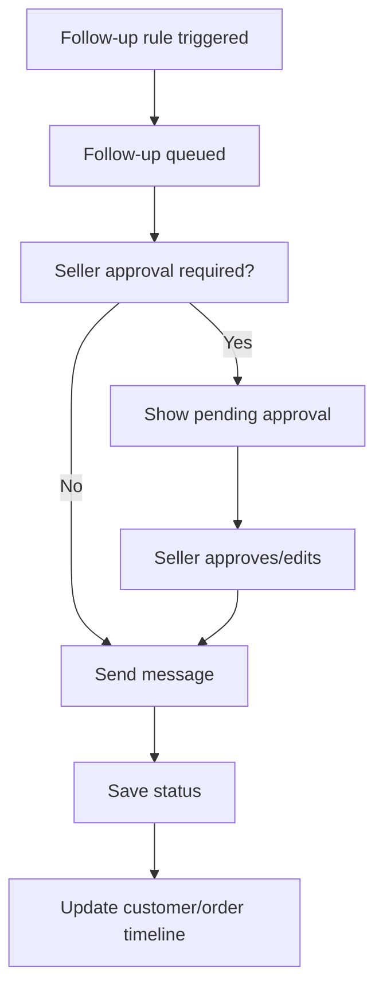

## 15.4 Follow-Up Approval Screen

Card format:

```text
Customer: Nusrat Jahan
Reason: Asked price but no order
Suggested message:
আপনি কি এখনও product টি নিতে চান? চাইলে আমি order confirm করে দিচ্ছি।

[Edit] [Send] [Skip]
```

---

# 16. Receipt and Trust Link Flow

## 16.1 Receipt Flow

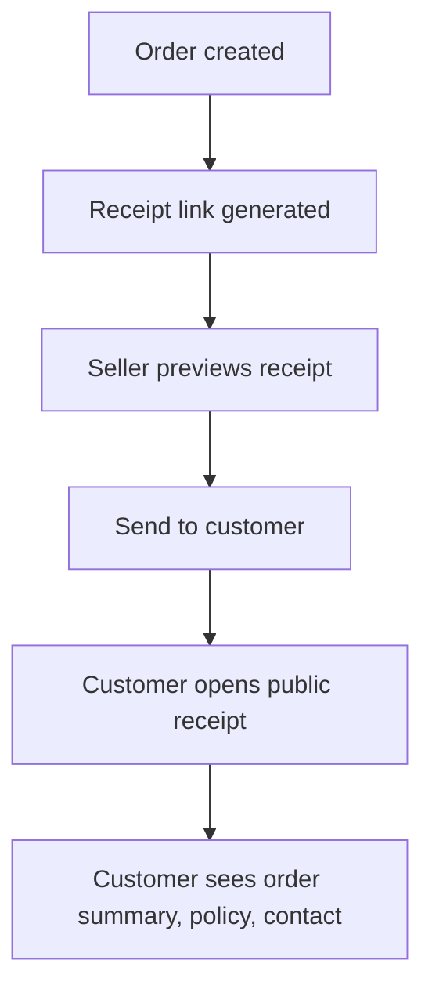

## 16.2 Receipt Page Contents

- Business logo
- Order number
- Customer first name or masked name
- Product list
- Total amount
- Payment status
- Delivery address summary
- Return policy
- Support contact
- Trust profile link
- Powered by Uddokta badge

## 16.3 Trust Profile Flow

```text
Settings → Trust Profile → Add policy/reviews/support → Publish → Share link
```

Public trust profile shows:

- Business name
- Logo
- Support number
- Delivery policy
- Return/refund policy
- Reviews if approved
- Order lookup support
- Complaint/support form

## 16.4 Privacy Rules

Public receipt links must not expose full phone number, full address, internal staff notes, payment screenshots, or private conversations.

---

# 17. Reports Flow

## 17.1 Report Purpose

Reports must show proof of business control, not abstract analytics.

## 17.2 Reports Screen Flow

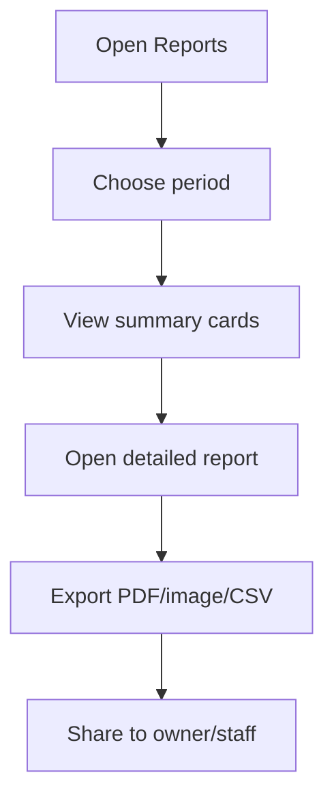

## 17.3 Report Cards

- Total messages
- Total orders
- Confirmed orders
- Returned orders
- Cancelled orders
- Follow-ups due/sent
- Top products
- Payment pending
- Staff response performance
- Estimated missed opportunities

## 17.4 Weekly Report Flow

```text
Scheduled report generated
→ owner receives report notification
→ owner opens report in Uddokta
→ owner can download/share
```

---

# 18. Channel Connection Flow

## 18.1 Channel Modes

Two modes:

### Demo Mode

- QR-based WhatsApp bridge or manual mock flow
- Used for demos and proof-of-concept
- Must show risk warning

### Production Mode

- Official WhatsApp Cloud API
- Messenger/Instagram APIs where available
- More stable and policy-compliant

## 18.2 Channel Setup Flow

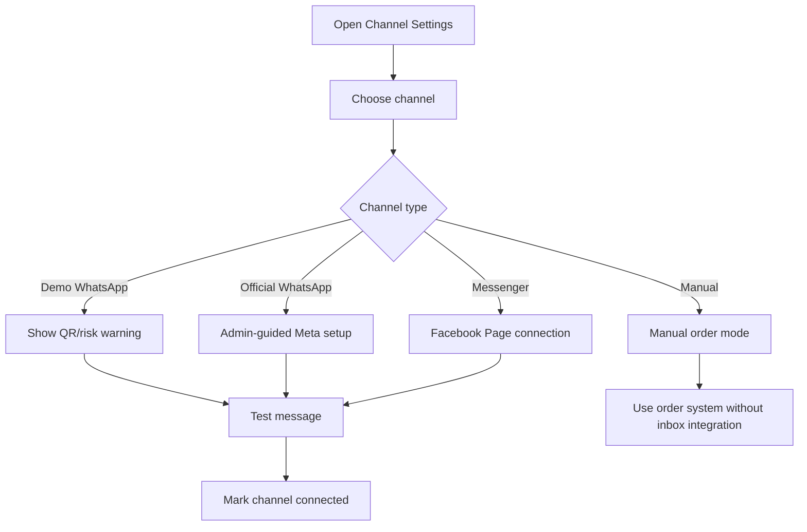

## 18.3 Channel Statuses

```text
Disconnected
Pending Setup
Connected
Needs Attention
Paused
Failed
```

## 18.4 Required Error States

- Token expired
- Webhook failed
- Message failed
- Business verification pending
- Template rejected
- QR session disconnected
- Bot paused

---

# 19. Admin App Flow

## 19.1 Admin Dashboard Flow

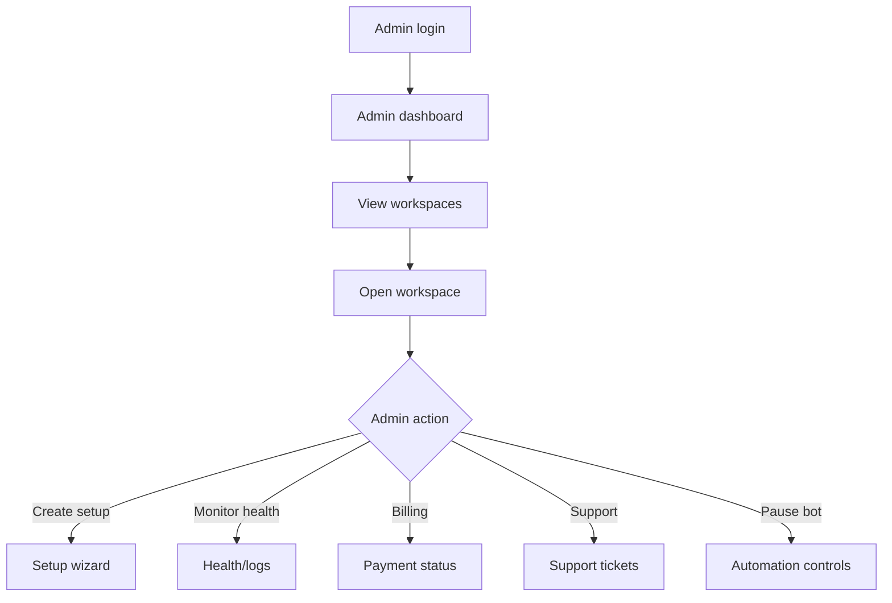

## 19.2 Admin Workspace Setup Wizard

Steps:

1. Create workspace
2. Add business profile
3. Add owner user
4. Add staff users
5. Import products
6. Add FAQ/policies
7. Add auto-reply templates
8. Configure channel
9. Create test customer
10. Create test order
11. Generate receipt
12. Send handover message

## 19.3 Admin Health Screen

Show:

- Workspace status
- Channel status
- Last inbound message
- Last outbound message
- Failed messages
- n8n workflow status
- Google Sheet backup status
- API usage estimate
- Billing status

---

# 20. Billing and Payment Flow

## 20.1 Early Manual Payment Flow

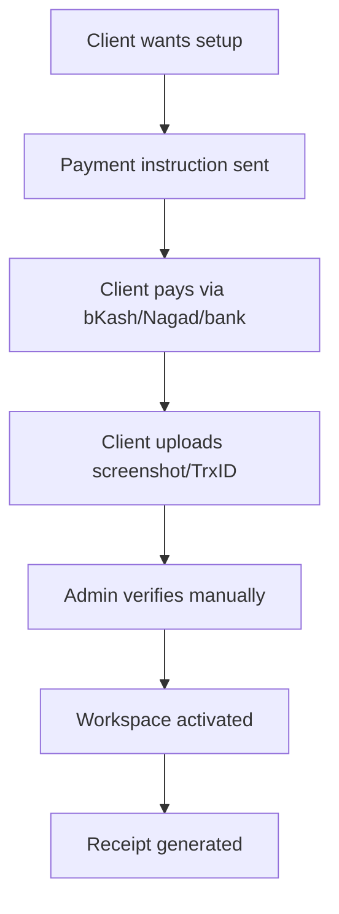

## 20.2 Billing Statuses

```text
Trial
Setup Pending
Active
Payment Due
Grace Period
Suspended
Cancelled
```

## 20.3 Suspended Account Flow

Do not delete data. Show:

```text
Your account is temporarily paused because payment is due. Your data is safe. Please contact support to reactivate.
```

Actions:

```text
Pay Now
Contact Support
Export Data
```

---

# 21. Notifications Flow

## 21.1 Notification Types

- New message
- Assigned conversation
- New order
- Payment proof uploaded
- Follow-up due
- Order returned
- Channel disconnected
- Weekly report ready
- Failed message
- Payment due

## 21.2 Notification Rules

Owner receives:

- Critical failures
- Daily summary
- Weekly report
- Payment/billing
- High-priority orders

Staff receives:

- Assigned conversations
- Follow-up due
- Order tasks

Admin receives:

- Integration failures
- Onboarding stuck
- Payment verification pending
- High error rate

---

# 22. Support Flow

## 22.1 Support Entry Points

- Help button in app
- WhatsApp support
- Support ticket form
- Admin-created issue

## 22.2 Support Categories

```text
Login issue
Inbox not syncing
Order problem
Payment issue
Report issue
Staff access issue
Auto-reply issue
Courier issue
Feature request
```

## 22.3 Support Ticket Flow

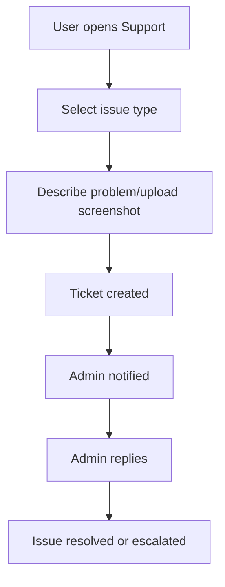

---

# 23. Empty State Flow

Every major screen must explain the next action.

| Screen | Empty State Copy | Primary Action |
|---|---|---|
| Home | Your dashboard is ready. Start by creating a test order. | Create Test Order |
| Inbox | No conversations yet. Connect an inbox or create manual order. | Connect Inbox |
| Orders | No orders yet. Create your first order from chat or manually. | New Order |
| Customers | No customers yet. Customers are saved when you create orders. | Add Customer |
| Products | Add products to send faster replies and create orders quickly. | Add Product |
| Reports | Reports appear after messages or orders are created. | Create Test Order |
| Follow-ups | No follow-ups due. Uddokta will show interested customers here. | View Orders |

---

# 24. Error and Recovery Flow

## 24.1 Message Send Failure

```text
Message failed to send.
Reason: Channel disconnected / provider error / invalid number.
Actions: Retry, Mark as handled, Contact support.
```

## 24.2 Integration Failure

```text
Your WhatsApp connection needs attention.
Auto replies are paused until the connection is fixed.
Your orders and customer data are safe.
```

## 24.3 Data Save Failure

```text
Could not save. Check your internet and try again.
```

App must retain draft locally where possible.

## 24.4 Low Network Flow

- Show skeleton loaders.
- Allow draft order creation if possible.
- Retry sync after connection returns.
- Avoid heavy pages or desktop-style tables.

---

# 25. Permissions Flow

## 25.1 Roles

| Role | Permissions |
|---|---|
| Owner | Full access, billing, settings, staff, reports |
| Manager | Inbox, orders, customers, products, reports, staff assignment |
| Staff | Assigned inbox, orders, customers, quick replies |
| Viewer | Reports and read-only data |
| Uddokta Admin | Internal workspace setup and support |

## 25.2 Restricted Actions

Only owner/admin can:

- Change plan
- Delete workspace
- Export all data
- Add/remove staff
- Connect channels
- Change payment settings
- Publish trust profile

---

# 26. Data Export and Backup Flow

## 26.1 Seller Export Flow

```text
Settings → Export Data → Choose data type → Generate export → Download CSV/Excel
```

Export types:

- Customers
- Orders
- Products
- Reports
- Reviews

## 26.2 Google Sheets Backup Flow

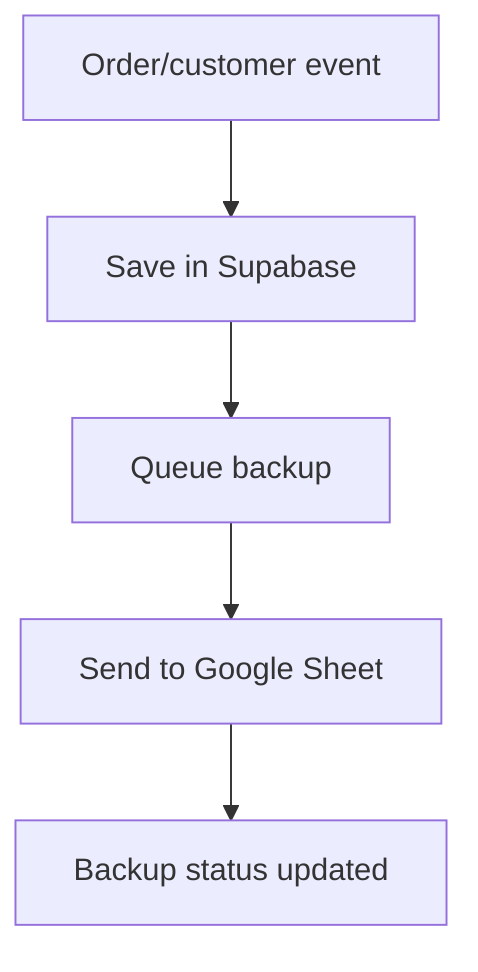

Backup must never replace primary database. It is for trust, portability, and client comfort.

---

# 27. Public Buyer Flow

## 27.1 Receipt Link Flow

```mermaid
flowchart TD
    A[Buyer receives receipt link] --> B[Open public receipt]
    B --> C[Review order summary]
    C --> D{Action}
    D -->|Need help| E[Contact seller]
    D -->|Confirm details| F[Order remains active]
    D -->|Leave review later| G[Review form]
```

## 27.2 Review Flow

```text
Delivered order → Review request message → Buyer opens review link → submits rating/comment → seller approves publishing → review appears on trust profile
```

## 27.3 Complaint Flow

```text
Receipt/trust page → Need help → Issue form → issue saved → seller/admin notified
```

---

# 28. First-Use “Aha Moment” Flow

The first-use moment must happen before deep integrations.

Ideal flow:

```text
Seller logs in
→ sees test customer message
→ taps Create Order
→ order card appears
→ taps Send Receipt
→ opens receipt link
→ sees professional proof page
```

This proves the value immediately.

Do not make the first-use experience depend on Meta verification, courier API, or advanced automation.

---

# 29. Flow Prioritization

## P0 Flows

These must exist first:

- Login/workspace access
- Home dashboard
- Products
- Customers
- Manual order creation
- Order board
- Order detail
- Receipt/trust link
- Basic reports
- Admin workspace creation
- Onboarding form
- Demo seeded data

## P1 Flows

Build after P0 is stable:

- Inbox UI
- Conversation detail
- Convert conversation to order
- Quick replies
- Follow-up reminders
- Google Sheet export
- Support ticket
- Staff roles
- Bot pause

## P2 Flows

Build after product-market validation:

- Official WhatsApp Cloud API connection
- Messenger/Instagram integration
- Courier API integration
- Review publishing
- Automated weekly PDF report
- Payment proof handling
- More advanced analytics

---

# 30. Screen Inventory

## Seller App Screens

```text
/login
/setup-pending
/app/home
/app/inbox
/app/inbox/[conversationId]
/app/orders
/app/orders/[orderId]
/app/orders/new
/app/customers
/app/customers/[customerId]
/app/products
/app/products/[productId]
/app/auto-replies
/app/follow-ups
/app/reports
/app/settings
/app/settings/business
/app/settings/staff
/app/settings/channels
/app/settings/trust-profile
/app/support
```

## Public Screens

```text
/public/receipt/[orderNumber]
/public/trust/[businessSlug]
/public/review/[orderToken]
/public/support/[businessSlug]
```

## Admin Screens

```text
/admin
/admin/workspaces
/admin/workspaces/new
/admin/workspaces/[workspaceId]
/admin/workspaces/[workspaceId]/setup
/admin/workspaces/[workspaceId]/health
/admin/workspaces/[workspaceId]/billing
/admin/support
/admin/leads
/admin/audits
```

---

# 31. Developer Notes for Claude/Codex

## 31.1 Build Order for App Flow

```text
1. Auth and workspace loading
2. Mobile app shell with bottom nav
3. Home dashboard with seed data
4. Products CRUD
5. Customers CRUD
6. Orders CRUD
7. Order board and status transitions
8. Receipt public page
9. Admin workspace creation
10. Onboarding form
11. Inbox mock UI
12. Conversation-to-order flow
13. Quick replies
14. Follow-ups
15. Reports
16. Integration stubs
```

## 31.2 Non-Negotiable Implementation Rules

- Every screen must work on mobile first.
- Every primary action must be reachable with one thumb.
- Every data query must be scoped by `workspace_id`.
- Every external message must have status tracking.
- Every automation must have manual override.
- Every failed integration must show a recovery path.
- Every customer-facing term must avoid API/webhook jargon.
- Every empty state must teach the user what to do next.

---

# 32. Final App Flow Verdict

Uddokta’s app flow should start from the seller’s real-life behavior: messages arrive, staff reply, orders are copied manually, payment proof appears as screenshots, courier details are handled separately, and the owner loses visibility.

The correct app flow is therefore not:

```text
CRM → campaign → automation → analytics
```

The correct Uddokta flow is:

```text
Inbox → Order → Customer Record → Receipt/Trust Proof → Follow-up → Report
```

The first build should make this flow feel real even before full WhatsApp/Messenger integration exists. The app must prove that Uddokta is a serious mobile command center for Bangladesh sellers, not another chatbot or agency dashboard.

---

**Should I continue to Document 4: UI/UX Design Brief?**
